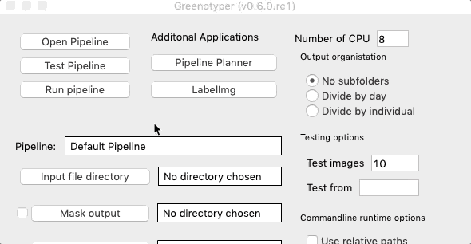

Greenotyper (v0.6.0.rc3)
================
[](https://travis-ci.com/MarniTausen/Greenotyper)[](https://codecov.io/gh/MarniTausen/Greenotyper)[](https://badge.fury.io/py/greenotyper)

-   [Installation](#installation)
-   [General workflow guide](#general-workflow-guide)
-   [GUI interface guide](#gui-interface-guide)
-   [Command line interface guide](#command-line-interface-guide)
-   [Pipeline setup guide](#pipeline-setup-guide)
-   [Neural net training](#neural-net-training)

Greenotyper is a image analysis tool for large scale plant phenotyping experiments.

It uses google's object detection api ([github link](https://github.com/tensorflow/models/tree/master/research/object_detection)) to find the plants and thresholding to measure the size of the plants.

Requirements
------------

- python version 3.6 or 3.7
- tensorflow v2.0.0 or higher
- PyQt5 v5.9.2 or higher
- numpy v1.15.2 or higher
- pillow v5.2.0 or higher
- scikit-image v0.14.0 or higher

Installation
------------

There are precompiled graphical versions in the releases folder.

**Currently there is only a Mac OS X version.** **There is no guarantee that the version works on versions less than 10.14.6**

It is recommended to install the tool in a virtualenv or in an environment in conda. Example:
```bash
conda create -n greenotyper_env python=3.7

conda activate greenotyper_env

pip install greenotyper
```
Install the latest version of greenotyper through pip:
```bash
pip install greenotyper
```
If there are problems with pip you can try calling pip3 instead:
```bash
pip3 install greenotyper
```

Install greenotyper through conda:
```
not available yet
```


General workflow guide
----------------------

Starting a new workflow requires setting up and testing the pipeline. It starts by opening the pipeline planner. Either you open the Greenotyper app, or opening the GUI through the commandline interface:
```bash
greenotyper --GUI
```

To open the pipeline planner, click the Pipeline planner button.

Testing the plant area detection, the network and pipeline settings are all done through the pipeline planner. For information on how use the interface go to the next section, and for general information on Pipeline setups click [here](#pipeline-setup-guide).

Running the pipeline is done either through the commandline or through the GUI. The commandline is more efficient and can more easily be deployed on computing clusters.

The pipeline can be run on individual images or directories of images. The results are a single "database" file, which uses filelocking. (If your file system has blocked filelocking, then there is no guarantee the results will be correctly written when run using multi processing.)

To organise the results into a table you can use the commandline option:
```bash
greenotyper -p mypipeline.pipeline -o input_file.csv output_file.csv
```

GUI interface guide
-------------------

Open the app, or run the GUI from the terminal:
https://github.com/MarniTausen/Greenotyper

### Pipeline Planner

#### Basics
First open the pipeline planner from the initial window.


Open your image.


Opening a trained network.


After both an image and the network have been opened, you can run find plants feature. Clicking on Find plants will draw bounding boxes around the detected plants.


To test the detection of the plant area you can use apply mask function.


#### Adjust mask settings

#### Adjust pipeline settings

### Pipeline Runner (Initial window)


Command line interface guide
----------------------------

Command usage help message:
```
=========== GREENOTYPER (v0.6.0.rc3) ===========
greenotyper -i image/directory -p settings.pipeline [options]

Options:
  -h, --help            show this help message and exit
  -i IMAGE, --in=IMAGE  Input image or directory of images for inference
                        (required)
  -n NETWORK, --network=NETWORK
                        Input neural network directory (required, if not
                        provided with pipeline file).
  -p PIPELINE, --pipeline=PIPELINE
                        Pipeline file containing all settings
  -t THREADS, --threads=THREADS
                        Number of threads available. Only used to run on
                        multiple images at a time. Default: 1. Settings less
                        than 0 use all available cores.
  -s SIZEDIRECTORY, --size_output=SIZEDIRECTORY
                        Output directory for the size measurements. Default is
                        no output.
  -g GREENNESSDIRECTORY, --greenness_output=GREENNESSDIRECTORY
                        Output directory for the greenness measurements.
                        Default is no output.
  -m MASKDIRECTORY, --mask_output=MASKDIRECTORY
                        Output directory for the produced masks. Default is no
                        output.
  -c CROPDIRECTORY, --crop_output=CROPDIRECTORY
                        Output directory for the cropped images. Default is no
                        output.
  --by_day              Subdividing the outputs based on per day. Recommended
                        to avoid file system overflow.
  --by_individual       Subdividing the outputs based on per day. Recommended
                        to avoid file system overflow.
  --GUI                 Open up the GREENOTYPER GUI.
  -o ORGANIZEOUTPUT, --organize=ORGANIZEOUTPUT
                        Organize and clean the output. Usage:
                        --organize=input_file output_file.   If included only
                        this action will be performed.
```

Pipeline setup guide
--------------------

Neural net training
-------------------
