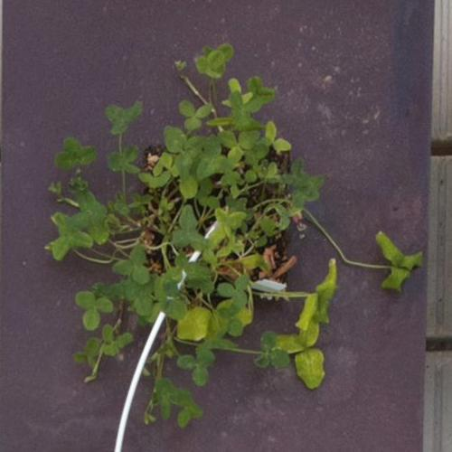
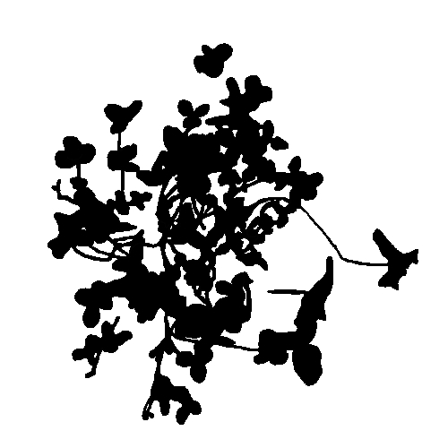

Greenotyper (v0.7.0)
================
[](https://travis-ci.com/MarniTausen/Greenotyper)[](https://codecov.io/gh/MarniTausen/Greenotyper)[](https://badge.fury.io/py/greenotyper)

-   [Installation](#installation)
-   [General workflow guide](#general-workflow-guide)
-   [GUI interface guide](#gui-interface-guide)
-   [Command line interface guide](#command-line-interface-guide)
-   [Pipeline setup guide](#pipeline-setup-guide)
-   [Neural net training](#neural-net-training)

Greenotyper is an image analysis tool for large scale plant phenotyping experiments.

It uses google's object detection api ([GitHub link](https://github.com/tensorflow/models/tree/master/research/object_detection)) to find the plants and thresholding to measure the size of the plants.

Requirements
------------

- python version 3.6 or 3.7
- tensorflow v2.0.0 or higher
- PyQt5 v5.9.2 or higher
- numpy v1.15.2 or higher
- pillow v5.2.0 or higher
- scikit-image v0.14.0 or higher
- Keras v2 or higher

Installation
------------

It is recommended to install the tool in a virtualenv or in an environment in conda. Example:

```bash
conda create -n greenotyper_env python=3.7

conda activate greenotyper_env

pip install greenotyper
```
Install the latest version of greenotyper through pip:

```bash
pip install greenotyper
```
If there are problems with pip you can try calling pip3 instead:

```bash
pip3 install greenotyper
```

Install greenotyper through conda:
```
not available yet
```


General workflow guide
----------------------

Starting a new workflow requires setting up and testing the pipeline. It starts by opening the pipeline planner. Either you open the Greenotyper app, or opening the GUI through the command line interface:

```bash
greenotyper GUI
```

To open the pipeline planner, click the Pipeline planner button.

Testing the plant area detection, the network and pipeline settings are all done through the pipeline planner. For information on how use the interface go to the next section, and for general information on Pipeline setups click [here](#pipeline-setup-guide).

Running the pipeline is done either through the command line or through the GUI. The command line is more efficient and can more easily be deployed on computing clusters.

The pipeline can be run on individual images or directories of images. The results are a single "database" file, which uses file locking. (If your file system has blocked file locking, then there is no guarantee the results will be correctly written when run using multi processing.)

To organise the results into a table you can use the command line option:

```bash
greenotyper organize-output input_file.csv output_file.csv
```

GUI interface guide
-------------------

Open the app, or run the GUI from the terminal:
https://github.com/MarniTausen/Greenotyper

### Pipeline Planner

#### Basics
First open the pipeline planner from the initial window.


Open your image.


Opening a trained network.


After both an image and the network have been opened, you can run find plants feature. Clicking on Find plants will draw bounding boxes around the detected plants.


To test the detection of the plant area you can use apply mask function.


#### Adjust mask settings

#### Adjust pipeline settings

### Pipeline Runner (Initial window)


Command line interface guide
----------------------------
The commandline is divided into subcommands, which each have their own options.
The standard help message showing the subcommands are shown here:

```
=========== GREENOTYPER (v0.7.0) ===========
usage: greenotyper <command> [<args>]

The available commands are as follows:
   run               Runs the greenotyper pipeline on set of images
   organize-output   Cleans and organizes the output
   GUI               Opens the Greenotyper GUI interface
   train-unet        Commandline options for creating and training the U-net
   test-unet         Test a trained u-net and output segmentation accuracies
   run-unet          Pipeline settings for running the unet version of the pipeline

Please see the options within each of the commands.
```

### Run
The greenotyper run command runs the Greenotyper tool using object detection and thresholding 

```
=========== GREENOTYPER (v0.7.0) ===========
usage: greenotyper run <pipeline file> <input image> [<args>]

Run the Greenotyper pipeline based on the pipeline settings provided.

positional arguments:
  pipeline              Required pipeline file.
  input                 Image filename or directory with images

optional arguments:
  -h, --help            show this help message and exit
  -t THREADS, --threads THREADS
                        Number of threads available. Only used to run on
                        multiple images at a time. Default: 1. Settings less
                        than 0 use all available cores.
  -s SIZE_OUTPUT, --size_output SIZE_OUTPUT
                        Output directory for the size measurements. Default is
                        no output.
  -g GREENNESS_OUTPUT, --greenness_output GREENNESS_OUTPUT
                        Output directory for the greenness measurements.
                        Default is no output.
  -m MASK_OUTPUT, --mask_output MASK_OUTPUT
                        Output directory for the produced masks. Default is no
                        output.
  -c CROP_OUTPUT, --crop_output CROP_OUTPUT
                        Output directory for the cropped images. Default is no
                        output.
  --by_day              Subdividing the outputs based on per day. Recommended
                        to use this option or --by_individual to avoid file
                        system overflow.
  --by_sample           Subdividing the outputs based on per individual.
                        Recommended to use this option or --by_day avoid file
                        system overflow.
```

### Organize-output
Organize-output

```
=========== GREENOTYPER (v0.7.0) ===========
usage: greenotyper organize-output <input> <output> [<args>]

Cleans and organizes the output

positional arguments:
  input       Input database.*.csv file
  output      Output .csv file in an organized format

optional arguments:
  -h, --help  show this help message and exit
```

### GUI
To open the user interface you can simply write:

```
greenotyper GUI
```

### run-unet
If the pipeline is to be run using U-net, then run-unet command should be used. The run-unet includes 3 more subcommands, which divide the pipeline into more steps. This was done so that the pipeline can be easily parallized with pre-processing and post-processing can be run seperately using has many processes as possible, and the U-net can be run on a GPU.

```
=========== GREENOTYPER (v0.7.0) ===========
usage: greenotyper run-unet <command> [<args>]

Running U-net is divided into 3 steps:
   preprocess      Runs the object detection and
                   saves the crops ready to be run
                   through the U-net
   process         Runs U-net on the images.
                   This can be run on a GUI for
                   large speed ups.
   postprocess     Output the results based on
                   the predicted masks from the U-net
            

Commands for running the U-net

positional arguments:
  command     Which run U-net command should be called

optional arguments:
  -h, --help  show this help message and exit
```

#### preprocess
Preprocessing for U-net

```
=========== GREENOTYPER (v0.7.0) ===========
usage: greenotyper run-unet preprocess <pipeline file> <input images> <output directory> [<args>]

Runs the object detection and prepares crops to be run through U-net

positional arguments:
  pipeline              Required pipeline file.
  input                 Directory with images
  outputdir             Output directory where the preprocessed data is saved.

optional arguments:
  -h, --help            show this help message and exit
  -t THREADS, --threads THREADS
                        Number of threads available to be used. Default: 1.
                        Settings less than 0 use all available cores.
  -b BATCH_SIZE, --batch-size BATCH_SIZE
                        Batch size of images run simultaneously. Default is
                        set to 10. Memory usage can be lower if the batch size
                        is smaller.
  --add_subdir ADD_SUBDIR
                        Provide a directory for a subdirectory which is added
                        to the output directory
```

#### process

```
=========== GREENOTYPER (v0.7.0) ===========
usage: greenotyper run-unet process <input dir> <unet>

Process the cropped data and produced predicted masks using U-net.

positional arguments:
  inputdir    Input directory where batch results from the preprocessing are
              located.
  unet        The trained Unet hdf5 file

optional arguments:
  -h, --help  show this help message and exit
```

#### postprocess

```
=========== GREENOTYPER (v0.7.0) ===========
usage: greenotyper run-unet postprocess <pipeline file> <inputdir> [<output args>]

Postprocessing of the U-net masks. Outputs the desired information.

positional arguments:
  pipeline              Pipeline settings file
  inputdir              Input directory containing processes data

optional arguments:
  -h, --help            show this help message and exit
  -t THREADS, --threads THREADS
                        Number of threads available. Only used to run on
                        multiple images at a time. Default: 1. Settings less
                        than 0 use all available cores.
  -s SIZE_OUTPUT, --size_output SIZE_OUTPUT
                        Output directory for the size measurements. Default is
                        no output.
  -g GREENNESS_OUTPUT, --greenness_output GREENNESS_OUTPUT
                        Output directory for the greenness measurements.
                        Default is no output.
  -m MASK_OUTPUT, --mask_output MASK_OUTPUT
                        Output directory for the produced masks. Default is no
                        output.
  -c CROP_OUTPUT, --crop_output CROP_OUTPUT
                        Output directory for the cropped images. Default is no
                        output.
  --by_day              Subdividing the outputs based on per day. Recommended
                        to use this option or --by_individual to avoid file
                        system overflow.
  --by_sample           Subdividing the outputs based on per individual.
                        Recommended to use this option or --by_day avoid file
                        system overflow.
```

### train-unet

Commandline options for training a U-net

```
=========== GREENOTYPER (v0.7.0) ===========
usage: greenotyper train-unet <training directory> <unet output> [<args>]

Commandline options for creating and training the U-net

positional arguments:
  training_directory    Directory with training data
  unet_output           Filename of the trained unet

optional arguments:
  -h, --help            show this help message and exit
  --validation_directory VALIDATION_DIRECTORY
                        Directory with validation data
  --validation_split VALIDATION_SPLIT
                        Fraction of the training data used for validation, if
                        no validation data is provided. Default is 0.2.
  --epochs EPOCHS       The number of training epochs to be used. Default 20
                        epochs
  --augment_data        By default all augmentations will be performed on the
                        training and validation data
  --no_flips            Do not perform flips while augmenting the data.
  --no_rotations        Do not perform rotations while augmenting the data.
  --no_crops            Do not perform corner crops while augmenting the data.
  --crop_size CROP_SIZE
                        The dimension of the crops, the default is 460x460,
                        input as 460, which is then rescaled to 512x512
```

### test-unet

Commandline options for testing the segmentation accuracy of a trained U-net

```
=========== GREENOTYPER (v0.7.0) ===========
usage: greenotyper test-unet <testing directory> <trained unet>

Test a trained U-net and get segmentation accuracy of the model

positional arguments:
  testing_directory     Directory with images and labelled ground truth images
  trained_unet          Filename of trained u-net model (.hdf5 format)

optional arguments:
  -h, --help            show this help message and exit
  --output_masks OUTPUT_MASKS
                        Output predicted masks to the provided directory
  --ap_iou_threshold AP_IOU_THRESHOLD
                        Set the IoU threshold used for the PASCAL VOC AP.
                        Default is 0.5
```


Pipeline setup guide
--------------------

Neural net training
-------------------

### Object detection
#### installation
The object detection is done using the tensorflow object detection api, found on [GitHub here](https://github.com/tensorflow/models/tree/master/research/object_detection).

This guide has been tested on commit up to: [8518d05](https://github.com/tensorflow/models/commit/8518d053936aaf30afb9ed0a4ea01baddca5bd17). Future versions might change and the following guide might not be relevant. To use the version that is known to work, you can open the commit, and click browse files and download the whole models repository from that commit.

The object detection api only works on tensorflow 1.x versions, and therefore should be trainined an enivorinment installed with the latest tensorflow 1.x version. It does not work with tensorflow 2+.

The whole install guide provided [here](https://github.com/tensorflow/models/blob/master/research/object_detection/g3doc/installation.md). If access to a GPU is available choose the tensorflow-gpu install over tensorflow. To be able use GPU, the [CUDA Toolkit](https://developer.nvidia.com/cuda-downloads) must be installed. Depending on the version of tensorflow installed, it depends on [different versions](https://www.tensorflow.org/install/source#tested_build_configurations). Supported tensorflow versions, 1.12.0, 1.13.0, 1.14.0 use different versions of CUDA. Version 1.12.0, depends on version 9 of CUDA, and versions 1.13.0 and 1.14.0 depend on version 10 of CUDA.

Here is a version of installing that worked on a Mac OS X system:

```bash
conda create -n ObjectDetection python=3.6

conda activate ObjectDetection

pip install tensorflow==1.14
```

Versions 1.13 and 1.12 of tensorflow should also work. Install the tensorflow-gpu version if the intent is to train on a GPU.
```bash
pip install tensorflow-gpu==1.14
```

Pip install tensorflow gets nearly all of the dependencies listed on the guide. However the remaining dependencies were installed like this:

```bash
conda install protobuf

pip install --user pycocotools
```

Next was retreiving the object detection API, by downloading the whole models repository. The API is dependent on other research packages in the repository. So start by cloning the latest version, or download this [commit](https://github.com/tensorflow/models/commit/8518d053936aaf30afb9ed0a4ea01baddca5bd17).

```bash
git clone https://github.com/tensorflow/models.git
```

Next is to "compile" some of the code from the api using the following command:

```bash
cd models/research/
protoc object_detection/protos/*.proto --python_out=.
```

Next make API callable, by exporting the directory to the python path:

```bash
export PYTHONPATH=$PYTHONPATH:`pwd`:`pwd`/slim
```

Now you can test whether the API works by running the following command:

```bash
python object_detection/builders/model_builder_tf1_test.py
```

You should get OK on all of the tests at the end. If you use tensorflow 1.14 you will get a lot of warnings, due to the version preparing people to upgrade to version 2, but you can ignore these.

#### Preparing training and testing data
The training and testing data was created using the [labelImg tool](https://github.com/tzutalin/labelImg). The bounding boxes are manually drawn using labelImg, which outputs .xml files which describes the bounding boxes which have been drawn and the name of the class.

The data has to be processed into into tha different format so that the object detection api can read and use the training and testing data.

For this we created a simple script which converts the image + .xml files into .record files used by the object detection api. The scripts can be found [here](https://github.com/MarniTausen/Greenotyper/tree/master/training_data/object%20detection/create_tf_input.py).
Usage of the script is as follows:

```bash
python create_tf_input.py inputdirectory -r output.record -l label_map.pbtxt
```

To produce the training data, the images with the xml files must be stored in a directory:

```bash
python create_tf_input.py traindirectory -r train.record -l label_map.pbtxt
```

The same for the testing data:

```bash
python create_tf_input.py testdirectory -r test.record -l label_map.pbtxt
```

Finally the [pipeline.config](https://github.com/MarniTausen/Greenotyper/blob/master/training_data/object%20detection/pipeline.config) file must be updated. Depending on what is being training, setting what the number of classes are being trained is important, and the number of steps the network is trained on. The full file locations of the training and testing (evaluation) data must be updated.

#### Training and Testing

Training can now be run following the guide [here](https://github.com/tensorflow/models/blob/master/research/object_detection/g3doc/running_locally.md). Training and evaluation (testing) are run with the same command.

To see the evaluation results you use tensorboard, which has been installed with tensorflow.

To export the network you can use the following export\_inference\_graph.py

```
python export_inference_graph.py \
    --input_type image_tensor \
    --pipeline_config_path path/to/filename.config \
    --trained_checkpoint_prefix path/to/model.ckpt \
    --output_directory path/to/exported_model_directory
```

This function outputs the frozen\_inference\_graph.pd. Adding this file together with the label_map.pbtxt into a network directory creates the network input used in Greenotyper.

### U-net

#### Ground truth data

To train a U-net a ground truth dataset must be created. Here is an example of what the training data should look like to the inputted data.

Cropped Image | Ground truth mask
:-------------:|:----------------:
|

The Cropped Image should be a square image and preferrably a resolution which is a multiple of 2, so (512x512) or (1024x1024). (512x512) was used in our case. The ground truth mask should be a black and white jpeg. The background is white and the mask is black.

The quality of the segmentation that U-net will be capable of performing will depend on the quality of the ground truth masks produced.

The ground truth dataset should be divided into 3 parts. Training, validation and testing. Validation is not mandatory, since you can set a validation split, which means that a fraction of the training data will be used as validation during training. 
In the study 50 ground truth images were produced, 10 were used for testing, 40 taken for training. 20% of the training data was used for validation, so 8 images were taken out, leaving 32 images in the training dataset.

For storing and inputting the data the images and ground truth should be stored in the image and label directories respectively. The directories are used as the input to the functions. Cropped images and their respective mask should have the exact same name. Please use the follow structure of directories:

```
- train
	- image
	- label
- validation
	- image
	- label
- test
	- image
	- label
```

#### Training the U-net
The options the train-unet command.

```
=========== GREENOTYPER (v0.7.0) ===========
usage: greenotyper train-unet <training directory> <unet output> [<args>]

Commandline options for creating and training the U-net

positional arguments:
  training_directory    Directory with training data
  unet_output           Filename of the trained unet

optional arguments:
  -h, --help            show this help message and exit
  --validation_directory VALIDATION_DIRECTORY
                        Directory with validation data
  --validation_split VALIDATION_SPLIT
                        Fraction of the training data used for validation, if
                        no validation data is provided. Default is 0.2.
  --epochs EPOCHS       The number of training epochs to be used. Default 20
                        epochs
  --augment_data        By default all augmentations will be performed on the
                        training and validation data
  --no_flips            Do not perform flips while augmenting the data.
  --no_rotations        Do not perform rotations while augmenting the data.
  --no_crops            Do not perform corner crops while augmenting the data.
  --crop_size CROP_SIZE
                        The dimension of the crops, the default is 460x460,
                        input as 460, which is then rescaled to 512x512
```

The command expects the training directory which contains the image and label directories, and the filename of the output unet. The currently best network during training will be saved to this filename.

The validation data can be provided with the --validation\_directory command. If this is not provided it will automatically use --validation\_split 0.2, and take 20% of the training data randomly as validation.

The number of training epochs can be set using the --epochs command. 1 epoch corresponds 1 full run through all of the training data. The default is set to 20 epochs, after this the network will start to overfit to the data. With more data available more epochs can be used before overfitting starts. By overfitting  it means that the training accuracy continues to increase while the validation accuracy will decrease.

Finally augmentation options are available. Using --augment\_data the training and validation data will be augmented to artificially increase the dataset sizes. By default it includes all of the augmentations available; flips, rotations and crops. Using all of the data will increase the datasets 40 fold. To disable any augmentation simply use --no\_nameofaugmentation. To change the cropping size you can use --crop\_size, by default it is set to 460. Which means it takes 4 crops from each corner of size 460x460 and rescales the crop back to 512x512. Avoid using crop size difference which are to large to avoid artifacts from rescaling.

#### Testing the U-net
Options for testing the trained U-net

```
=========== GREENOTYPER (v0.7.0) ===========
usage: greenotyper test-unet <testing directory> <trained unet>

Test a trained U-net and get segmentation accuracy of the model

positional arguments:
  testing_directory     Directory with images and labelled ground truth images
  trained_unet          Filename of trained u-net model (.hdf5 format)

optional arguments:
  -h, --help            show this help message and exit
  --output_masks OUTPUT_MASKS
                        Output predicted masks to the provided directory
  --ap_iou_threshold AP_IOU_THRESHOLD
                        Set the IoU threshold used for the PASCAL VOC AP.
                        Default is 0.5
```

Subcommand test-unet takes 2 main arguments the directory with the testing data, and the trained unet. It will calculate all of the segmentation accuracies implemented and print a report. The segmentation accuracies implemented are Jaccard Index (Intersection Over Union), Dice coefficient, Recall, Precision, Pixel Accuracy, F1 score and the PASCAL VOC AP or Average Precision over Recall.

The --ap\_iou\_threshold option allows to change was the IoU (Intersection over Union) threshold used for the PASCAL VOC AP measure is. By default it is 0.5, which means if a mask has an IoU less than 0.5 it will be removed.

The --output\_masks option can output the predicted masks used for the segmentation accuracies. The option expects a directory where it can write the output masks.

If the U-net gets high segmentation accuracies, then it is ready for being used in the analysis.

